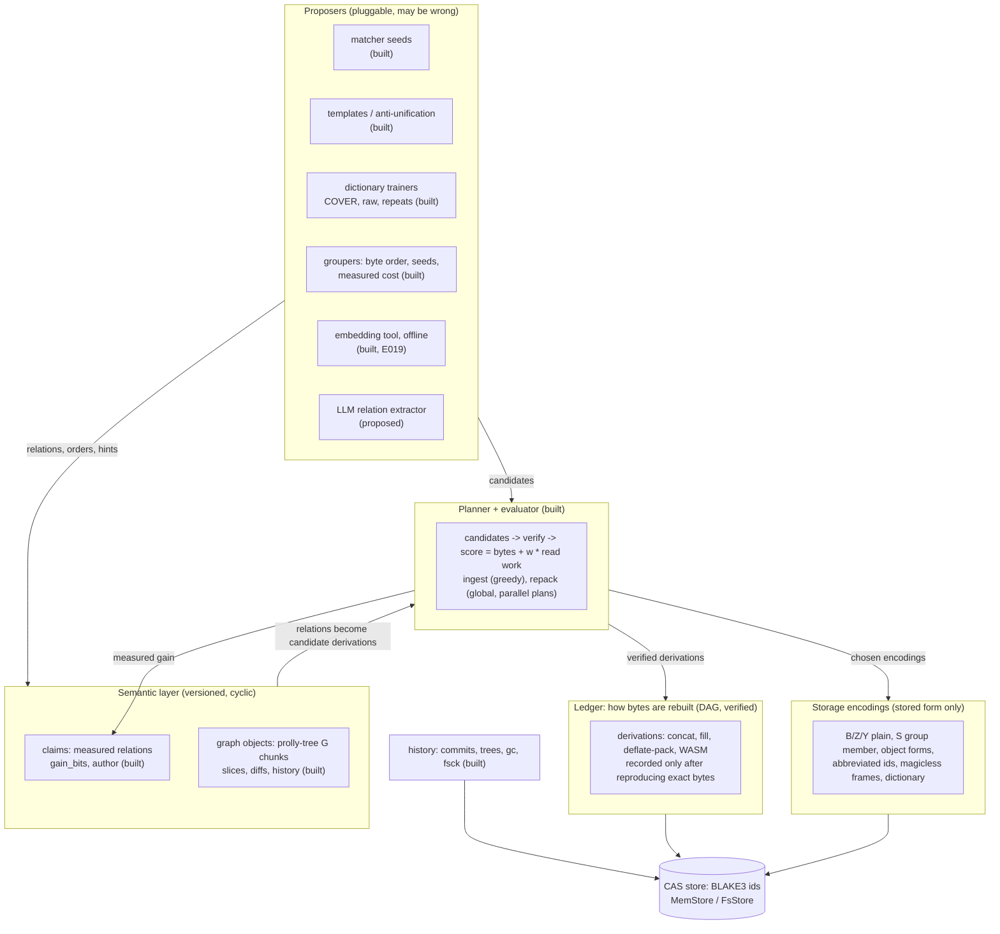
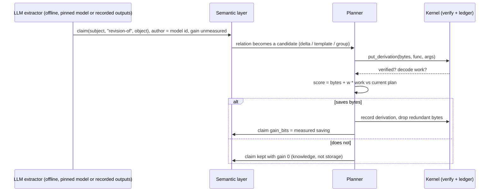
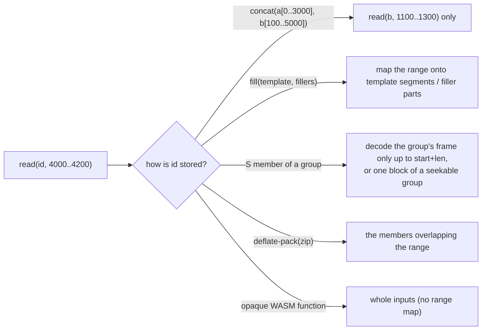

# IKAM system architecture (proposed)

Status: proposal. Parts marked **built** exist on `feature/rust-kernel` (experiments E000–E020); parts marked **proposed** do not. Claims about effects are measured only where an experiment is cited.

## The idea in one paragraph

Every file is stored as verified, content-addressed bytes. **How** its bytes are stored (whole, sliced, templated, grouped, derived by a function) is a replaceable plan, chosen by measured size and read cost. The **meaning** of content (relations, entities, versions, render structure) is a separate, versioned graph layer. Semantic proposers, including LLMs, write into that layer. The planner turns the layer's relations into candidate derivations, and only what is verified byte-exactly and measured to pay is kept. Meaning can therefore guide storage but never corrupt it.

## Layers

| layer | role | guarantee |
|---|---|---|
| CAS store | bytes by id | ids are BLAKE3; every read is checked against its id |
| Encodings | the smallest stored form of the same bytes | changing an encoding never changes an id |
| Ledger | `output = func(args)`, a DAG | recorded only if it rebuilds the exact bytes; cycles rejected |
| Planner and evaluator | chooses among verified candidates | score = bytes written + `read_weight` x decode work |
| Semantic layer | claims (measured, mutable) and graphs (versioned snapshots) | never on the rebuild path, so cycles are safe |
| Proposers | suggest relations, orders, candidates | may be wrong or nondeterministic; nothing they produce is trusted unverified |
| History | commits, trees, gc, fsck | gc keeps what live data needs: derivation inputs, dictionaries, groups, graph targets |

## LLM relations into compression (proposed)

An LLM is good at naming *why* two pieces of content are related. Byte matching cannot see that. Each relation type maps to the compression mechanism worth trying:

| relation (free-text predicate) | candidate the planner tries | mechanism |
|---|---|---|
| revision-of, copy-of, derived-from | delta: slices of the base, or `fill` with the base as template | ledger derivation (built) |
| same-form-as (invoice, report, slide) | induce one template over the set | templates (built) |
| same-topic-as, same-project-as | put in one group; train a family dictionary | groups (built), per-family dictionary (proposed) |
| contains, embeds, rendered-from | unpack the container; derive the rendering | `deflate-pack`, WASM functions (built) |
| translation-of, summary-of | none expected to pay | kept as knowledge only |

Rules that keep this sound:
- **Reproducibility.** Model calls never run inside the benchmark or the kernel. An extractor writes its relations once (claims, or a proposal file as in E019) with the model id and revision recorded. Re-running the planner on the same relations gives the same store.
- **No trust in model output.** A wrong relation costs a failed verification or a rejected plan, never wrong bytes.
- **Learning from measurements.** Measured `gain_bits` per relation type is the training signal for which relations to propose. This is DeepSketch's lesson: learn from measured compression, not from semantic similarity. E019 measured embeddings as informative but dominated by measured cost.

## Partial reads: decompress only the segments needed (proposed)

**Yes, the render structure lets reads decode only what they need, with one codec-level limit.**

A file's render pipeline is already explicit in the ledger: `concat` of byte ranges, `fill(template, fillers)`, `deflate-pack(manifest, members)`, groups. Graph nodes can name semantic segments as `Arg::Range` targets ("slide 3", "section 2"). A range read can therefore walk the pipeline backwards:

- **concat and slices**: exact. A range of the output is a computable set of ranges of the inputs.
- **fill**: exact. Template segments and filler parts have known offsets.
- **Containers**: a range of a zip maps to the members that cover it, plus header bytes.
- **Opaque WASM functions**: no general range map, so whole inputs are needed, unless the function declares one (a proposed extension).
- **The codec limit.** A zstd frame decodes sequentially. Inside a group, reading a member must decode from the frame start to the member's end: on average half the group, not all of it as today. To read one segment in O(segment), a group is split into **independently decodable blocks** (zstd's "seekable format": frames of a few KiB plus an offset table, shipped in zstd's `contrib/`). Blocks lose some shared context, and the dictionary recovers part of it. The block size is then a measured trade-off.

With range reads, the evaluator can price **decode work actually needed** for a given access pattern (whole files, or segments named in the graph), instead of today's proxy (bytes produced by derivations, decompression unpriced).

## What exists and what is next

| step | status | measure |
|---|---|---|
| CAS, ledger, verify-before-record, history, gc, fsck | built | all laws and tests (55) |
| encodings, dictionary, groups, abbreviated ids | built | score 0.8896 -> 0.4762 (E000–E020, two benchmark changes) |
| graphs: prolly chunks, cycles, slices, diffs | built | laws 1–7; repo-graph corpus |
| proposer hook (orders) and offline embedding tool | built | E019 (neutral) |
| read benchmark: per-read decode work for whole-file and segment reads | proposed, next | new reported metric, not scored at first |
| range reads through concat, fill, containers and groups (stop the frame early) | proposed | decode work per read, same stored bytes |
| seekable groups (independent blocks) | proposed | bytes vs decode work per read, block size swept |
| evaluator prices decompression | proposed | score and read metric together |
| LLM relation extractor writing claims; relation-to-candidate mapping | proposed (needs an API key or a local model) | bytes saved per relation type (measured `gain_bits`) |
| per-family dictionaries from relations | proposed | office/md bytes |
